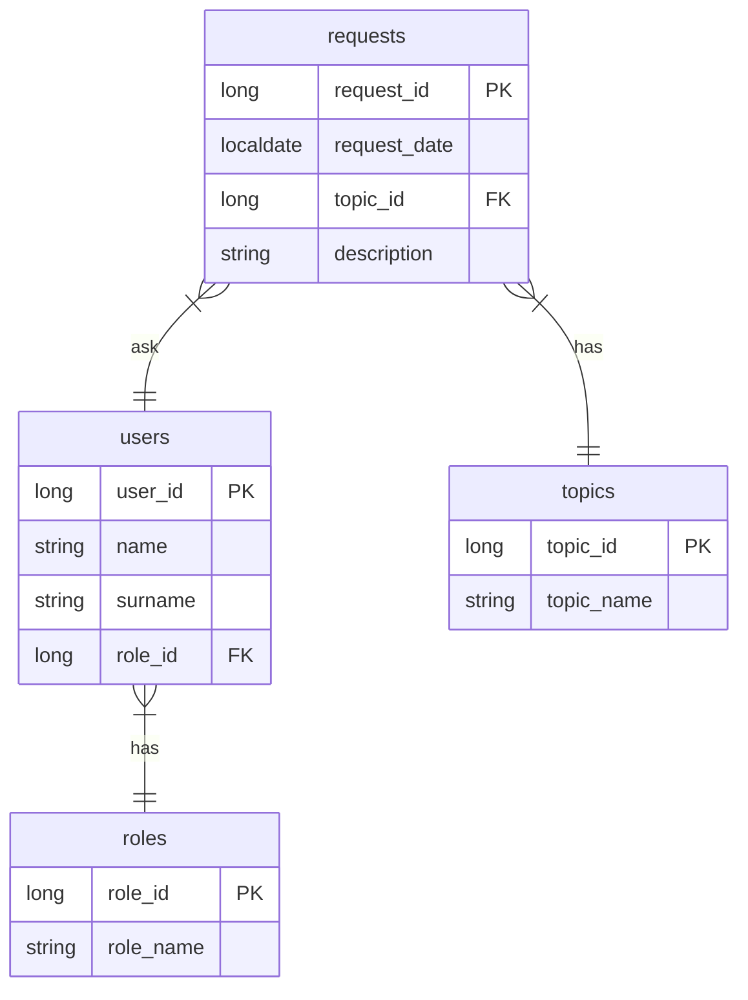

```mermaid
    erDiagram
    roles{
        long role_id PK
        string role_name
    }
    
    users {
        long user_id PK
        string name
        string surname
        long role_id FK
    }
    
    requests {
        long request_id PK
        localdate request_date
        long topic_id FK
        string description
    }

    topics {
        long topic_id PK
        string topic_name
    }

    requests }|--|| users : ask
    requests }|--|| topics : has
    users }|--|| roles : has

```